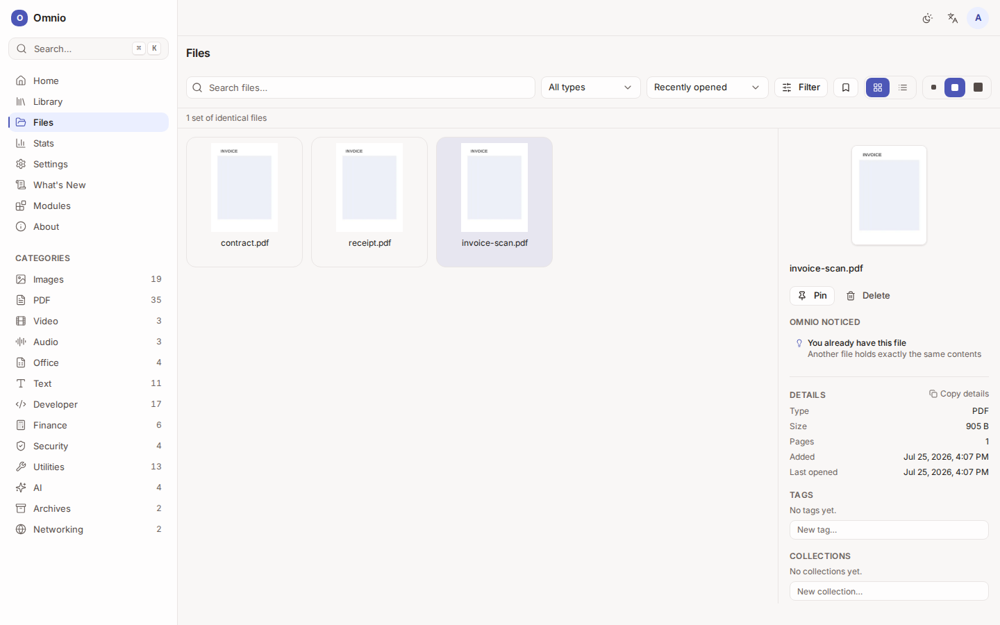
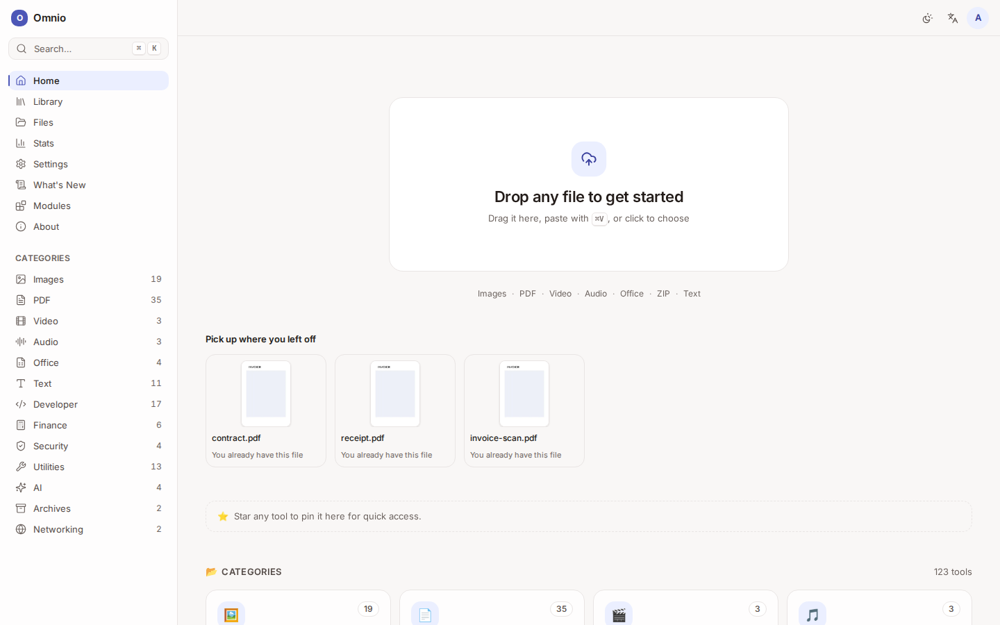

<div align="center">

# Omnio

### Your files. Your computer. Nobody else's business.

Omnio is a workspace for everyday file work — PDFs, images, documents, text —
that runs on **your own machine** instead of somebody else's server.

[What it does](#what-you-can-actually-do) · [Why not a website](#why-not-just-use-a-free-online-converter) · [How it works](#how-it-works) · [Run it](#run-it-yourself)

</div>

---

## The problem

You need to sign a PDF. Or shrink a photo. Or turn a scan into something you can
search.

So you find a free website, upload your document, and click a button. It works.

But think about what just happened. Your tax return, your contract, your
passport scan — you handed it to a stranger's computer. You don't know where it
went, how long it stays, or who reads it. The site was free because **the file
was the payment**.

Then next week you do it again. And you upload it again.

## What Omnio does instead

Omnio does the same jobs, but the file never leaves your machine. Open it, and
the work happens right there — no upload, no account, no waiting on a server, no
"your file will be deleted in two hours, probably".



It also *remembers*, which is the part people don't expect.

---

## What you can actually do

**Documents.** Merge, split, rotate and reorder pages by dragging them around
like paper. Sign a document. Fill in a form. Highlight, annotate, and genuinely
redact — the words underneath are removed, not hidden behind a black rectangle.
Compress a file that's too big to email. Protect one with a password. Turn a
scan into something you can search and copy from. Build a table of contents.

**Pictures.** Resize, crop, convert, compress. Strip the location and camera
details photos quietly carry around.

**Office files.** Turn Word, Excel and PowerPoint into PDFs.

**Everything else.** Convert between data formats, generate and decode, compare
and clean up text, run the small calculations that come up in a day. Around a
hundred tools — but the number isn't the point, and Omnio doesn't chase it.

---

## The part people don't expect

### It notices what your files are

Drop in a scanned contract and Omnio says:

> **Looks like a scan** — no selectable text — this looks like a scan
> → *Make it searchable*

It spots screen captures, photos from a camera, files you already have an
identical copy of, and files too big to send comfortably. **It always tells you
why it thinks so**, so nothing feels like a guess — and it stays quiet when it
genuinely doesn't know.

### It learns how you work

Rotate a scan, then compress it. Omnio notices. Next time you open a file like
it, Omnio offers to do the same again — and passes the result from one step to
the next by itself.

You never build a workflow. There's no canvas, no boxes and arrows, no settings
screen. **Doing the job once is the setup.**

### It tells you when something has gone out of date

You turned a report into a PDF last Tuesday. On Thursday you edited the report
again. Nothing anywhere would normally mention that the PDF you're about to send
is now the old version — but Omnio saw both files, and remembers which came from
which:

> **Q3 report.pdf may be out of date** — it was made from Q3 report.docx, and a
> newer version of that file arrived 2 days ago
> → *Update it*

One click reopens the right tool with the newer document already loaded. When
it finishes, the new file takes the old one's name, the stale copy is archived,
and the notice disappears — because it isn't true any more.

Omnio notices other things too: drafts of the same document, one picture kept at
several sizes, the afternoon you spent on a batch of files, the leftovers of
finished work still taking up space. **Each one says why**, each one offers the
single safest next step, and any of them can be waved away for good.

### It notices what you didn't finish

Open a document, get distracted, close the tab. Omnio will be waiting with a way
straight back to where you were. It says nothing while you're still working, and
nothing at all once you've saved something.



---

## Why not just use a free online converter?

|  | A free converter site | Omnio |
|---|---|---|
| Where your file goes | Uploaded to their server | Stays on your machine |
| Who can read it | You don't know | You |
| Account required | Usually | Never |
| File size limits | Yes, to sell you a plan | Your disk |
| Watermarks and paywalls | Often | None |
| Works offline | No | Yes |
| Remembers your work | No | Yes |
| Cost | Your file | Free, and open source |

One honest exception: turning Office documents into PDFs is a heavy job that runs
on the Omnio server rather than in your browser. If you self-host, that server is
*your* machine. Omnio says so in the product rather than hiding it.

---

## How it works

```
        Your browser                          Your server (optional)
 ┌───────────────────────────┐         ┌────────────────────────────┐
 │  Nearly every tool runs   │         │  The few heavy jobs that   │
 │  right here. Your file    │         │  can't run in a browser,   │
 │  never goes anywhere.     │         │  on hardware you own.      │
 └───────────────────────────┘         └────────────────────────────┘
              │
              ▼
 ┌───────────────────────────┐
 │  Your files are kept on   │   Nothing is synced. Nothing is uploaded.
 │  your device, so they're  │   No profile, no history on anyone's server.
 │  still there tomorrow.    │
 └───────────────────────────┘
```

**Local-first isn't a feature here, it's the rule.** Omnio has no cloud storage,
no accounts, no user profiles, and no server-side memory of you. When Omnio
learns something about how you work, it learns it on your device, and it stays
there.

Your files live in your browser's private storage on your own machine. That makes
them fast and private — and it also means they aren't a backup. Clearing your
browser's data clears them, and Omnio tells you that plainly rather than letting
you assume otherwise.

---

## Run it yourself

Omnio is free and open source.

```bash
git clone https://github.com/MordechaiN/Omnio.git
cd Omnio
cp .env.example .env          # then set OMNIO_SESSION_SECRET
docker compose -f docker/compose.yaml --env-file .env up -d --build
```

Then open <http://localhost:7400>.

Omnio runs on ports 7400–7449 and nothing else, so it won't take 3000 or 5432
from anything else you have running. Set `WEB_PORT` in `.env` to move it.

Developer setup, architecture and contribution notes live in [`docs/`](docs/)
and [`CONTRIBUTING.md`](CONTRIBUTING.md).

---

## About

Omnio is created by **[Mordechai Neeman](https://github.com/MordechaiN)**.

It's licensed under [Apache-2.0](LICENSE): you can use it, fork it, change it,
redistribute it, and build a business on it — commercial use included. The one
thing the licence asks is that you keep the attribution and the
[`NOTICE`](NOTICE) file intact. That file spells out exactly what to preserve, in
plain language.

Omnio speaks English and Hebrew, right-to-left included, and everything you read
in it — down to the release notes — is written in your language rather than
machine-translated.
